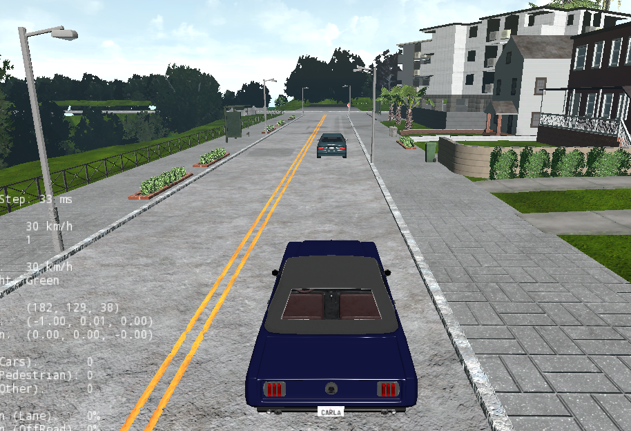
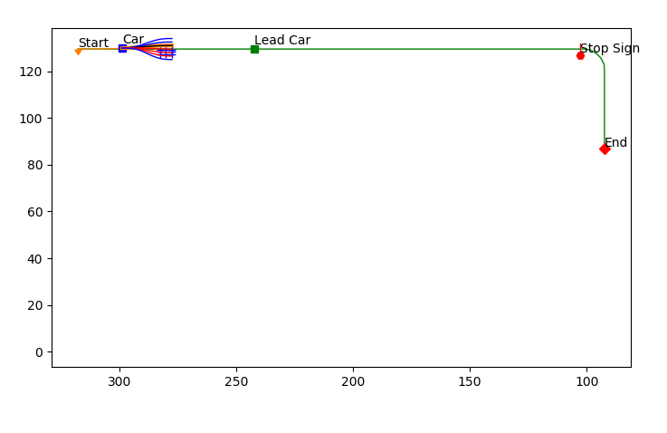
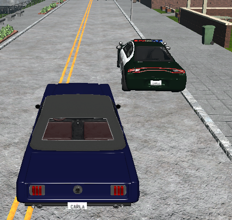
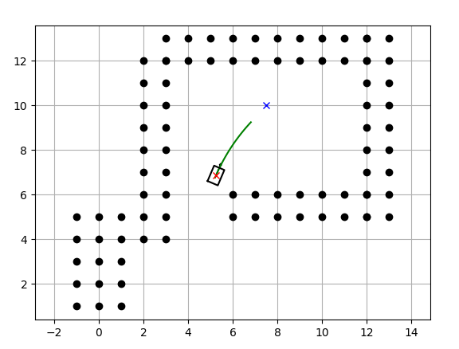
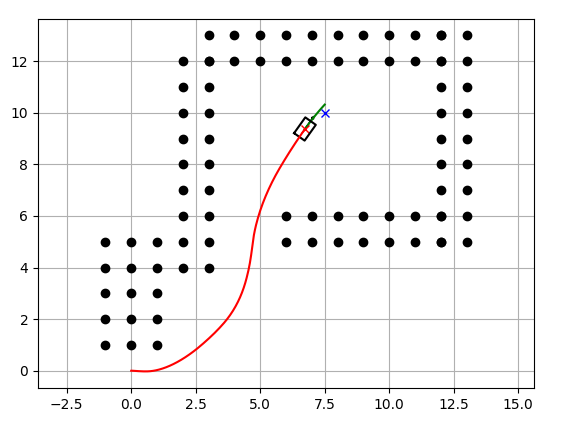
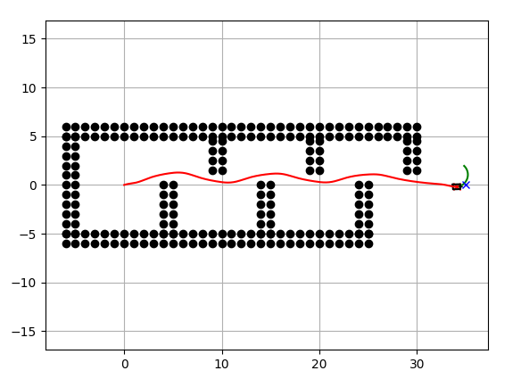
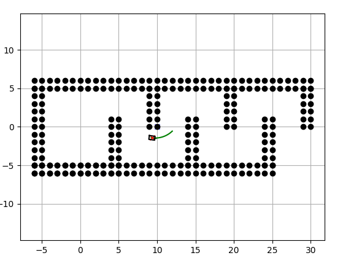
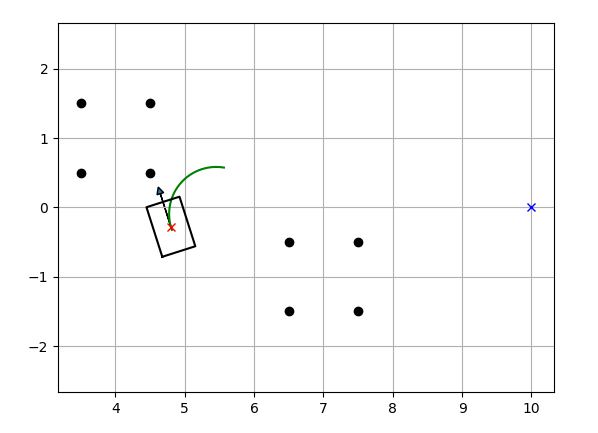
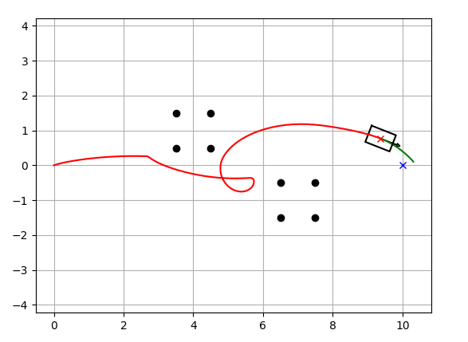

# Objective
To implement behavioural and local planning for self-driving cars, over CARLA simulator (Physics Engine for Self-Driving Cars). The goal of this project will be to have a functional motion planning stack that can avoid both static and dynamic obstacles while tracking the centre line of a lane, while also handling stop signs. To accomplish this, I would try to implement behavioural planning logic, as well as static collision checking, path selection, and velocity profile generation for a vehicle agent in CARLA Simulator. 

# Carla Simulator 

*** The Following Setup is Tested on Ubuntu 18.04 only, and is a rendition from the setup guide developed by University of Toronto ***

## References 

All rights for the Carla Simulator belong to <br />

CARLA: An Open Urban Driving Simulator <br />
Alexey Dosovitskiy, German Ros, Felipe Codevilla, Antonio Lopez, Vladlen Koltun; PMLR 78:1-16 <br />

@inproceedings{Dosovitskiy17,  <br />
  title = {{CARLA}: {An} Open Urban Driving Simulator}, <br />
  author = {Alexey Dosovitskiy and German Ros and Felipe Codevilla and Antonio Lopez and <br /> Vladlen Koltun}, <br />
  booktitle = {Proceedings of the 1st Annual Conference on Robot Learning}, <br />
  pages = {1--16}, <br />
  year = {2017} <br />
} <br />

## Requirements 
1. Pillow>=3.1.2
2. numpy>=1.14.5
3. protobuf>=3.6.0
4. pygame>=1.9.4
5. matplotlib=3.1.0 
6. future>=0.16.0
7. scipy>=0.17.0
8. ​Ubuntu >= 16.04 , (Not Tested on 20.04)
9. The CARLA python client runs on ​Python 3.5.x or Python 3.6.x​ (x is any number).Python 3.7.x is not compatible with CARLA​.

## Installation Guide for Carla Modified for this project (Linux/Ubuntu)

1. ```sudo ufw status``` describes the firewall status over Ubuntu, and should return the response as ```Status: inactive```

2. ```python3 -m pip --version``` should return either python 3.5 or python 3.6

3. ```pip3 install numpy --user```

4. ```sudo apt-get install libreadline-gplv2-dev libncursesw5-devlibssl-dev libsqlite3-dev tk-dev libgdbm-dev libc6-dev libbz2-dev```

5. Preparing for the Installation 
    - Download the Carla Simulator from [Carla.zip!](https://drive.google.com/file/d/1nrxd-k_ZxbAA8OOg2jyR4myUqLTZFczR/view?usp=sharing)
    - Trickle into /root/opt/​
    - Extract the contents of ​[Carla.zip!](https://drive.google.com/file/d/1nrxd-k_ZxbAA8OOg2jyR4myUqLTZFczR/view?usp=sharing) into ```/home​/opt/```, (this step might require super-user access)
    - ```unzip Carla.zip``` (this step might require super-user access)
    - Copy the Contents of Carla Folder (Which contains a folder named CarlaSimulator) into /root/opt
    - Current Working Directory Should be: ```/root/opt/​CarlaSimulator```
    - Current Working Directory -> /opt/CarlaSimulator/
    - ```python3 -m pip install -r ​requirements.txt --user```
    - This project requires a very particular version of Matplotlib and Carla is very particular about the versions about requirements mentioned above, anything else will lead to compilation error. The version of Carla for this project is backdated, since the latest version on ```https://carla.readthedocs.io/en/latest/download/``` uses dockers and Vulcan Drivers which is very cumbersome, and machine dependent. 
    - ```git clone https://github.com/arpit6232/Autonomous_Vehicle_Lattice_planner.git``` the repository copy the contents in the /opt/CarlaSimulator/PythonClient

## Project Report 
<a href="Project_Report.pdf" class="image fit">" Project Report"></a>

## Code Run

1. ```main_client_project.py``` is the main file which handles all the communication between the planners and the Carla Simulator. 

2. In a separate terminal window run in the working directory ```/root/opt/​CarlaSimulator``` <br />
 Run ```./CarlaUE4.sh /Game/Maps/Course4 -windowed -carla-server -benchmark -fps=30```
 , this acts the server for the Carla Server <br />

3. In a separate terminal window run the following command , this acts the client for the Carla Server <br /> ```sudo python3 main_client_project.py```

4. Fair Warning, the code can run slowly depending on the machine. 

5. Snippets of the Algorithm
  -  </b>
  -  </b>
  -  </b>
  -  </b>

## Trajectory Rollout Algorithm with Dyanmic Windowing

- ```git clone https://github.com/arpit6232/Autonomous_Vehicle_Lattice_planner.git``` into any folder 

- Run Command
  - ```python rollout.py```
  - Enter 1 for Workspace 1, Enter 2 for Workspace 2, Enter 3 for Workspace 3: 
    - Select a particular workspace, and the code begins

- Snippets of the Algorithm
-  </b>
-  </b>
-  </b>
-  </b>
-  </b>
-  </b>